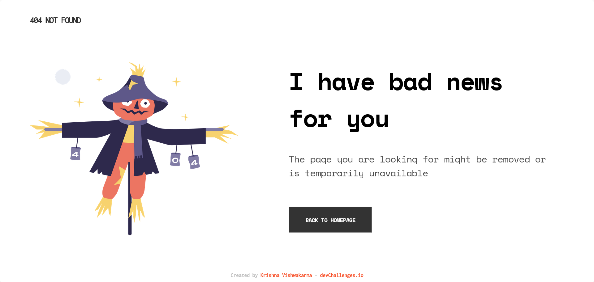

<!-- Please update value in the {}  -->

<h1 align="center">404 Not Found</h1>

   Solution for a challenge from  <a href="http://devchallenges.io" target="_blank">Devchallenges.io</a>.

    <h3>
        <a href="https://krishnavishwakarma1595.github.io/devChallenges/404-not-found/">
            Demo
        </a>
         | 
        <a href="https://devchallenges.io/solutions/KofWOr74faQRB9Z3mxwo">
            Solution
        </a>
         | 
        <a href="https://devchallenges.io/challenges/wBunSb7FPrIepJZAg0sY">
            Challenge
        </a>
    </h3>

<!-- TABLE OF CONTENTS -->

## Table of Contents

-   [Overview](#overview)
    -   [Built With](#built-with)    
-   [Features](#features)
-   [Contact](#contact)

<!-- OVERVIEW -->

## Overview

### Built With

<!-- This section should list any major frameworks that you built your project using. Here are a few examples.-->

- Semantic HTML5 markup
- CSS custom properties
- CSS Flexbox
- CSS Grid
- Mobile-first workflow
- [Animate CSS](https://animate.style/)

## Features

<!-- List the features of your application or follow the template. Don't share the figma file here :) -->

This application/site was created as a submission to a [DevChallenges](https://devchallenges.io/challenges) challenge. The [challenge](https://devchallenges.io/challenges/wBunSb7FPrIepJZAg0sY) was to build an application to complete the given user stories.

## Contact

-   Fronend Mentor [@KrishnaVishwakarma1595](https://www.frontendmentor.io/profile/KrishnaVishwakarma1595)
-   Codewars [@krish_codewars_797](https://www.codewars.com/users/krish_codewars_797)
-   Twitter [@KrishnaVis6026](https://twitter.com/KrishnaVis6026)
