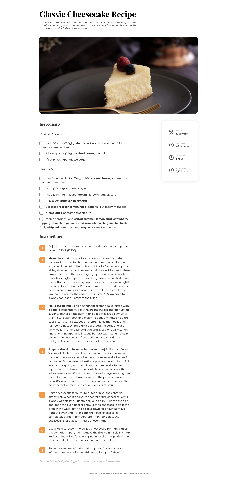

<!-- Please update value in the {}  -->

<h1 align="center">Recipe Blog Page</h1>

   	Solution for a challenge from  <a href="http://devchallenges.io" target="_blank">Devchallenges.io</a>.

	<h3>
		<a href="https://{your-demo-link.your-domain}">
			Demo
		</a>
		 | 
		<a href="https://{your-url-to-the-solution}">
			Solution
		</a>
		 | 
		<a href="https://{your-url-to-the-challenge}">
			Challenge
		</a>
	</h3>

<!-- TABLE OF CONTENTS -->

## Table of Contents

-   [Overview](#overview)
    -   [Built With](#built-with)    
-   [Contact](#contact)

<!-- OVERVIEW -->

## Overview

### Built With

<!-- This section should list any major frameworks that you built your project using. Here are a few examples.-->

- Semantic HTML5 markup
- CSS custom properties
- CSS Flexbox
- CSS Grid
- Mobile-first workflow
- [Animate CSS](https://animate.style/)
- [Custom Checkbox](https://codepen.io/markupbang-1473322092/pen/mrJxQG)
- [How to change list marker style](https://blog.logrocket.com/styling-numbered-lists-with-css-counters/)

## Contact

-   Fronend Mentor [@KrishnaVishwakarma1595](https://www.frontendmentor.io/profile/KrishnaVishwakarma1595)
-   Codewars [@krish_codewars_797](https://www.codewars.com/users/krish_codewars_797)
-   Twitter [@KrishnaVis6026](https://twitter.com/KrishnaVis6026)
